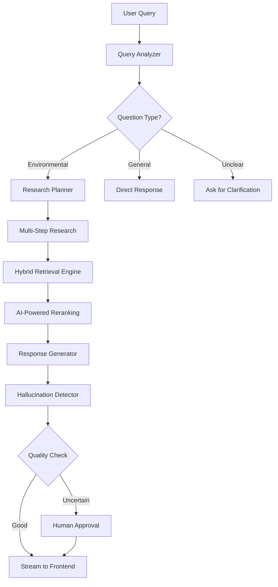

# 🚀 **RAGHive - A Multi-Agentic RAG System**

[](https://python.org)
[](https://langchain-ai.github.io/langgraph/)
[](https://reactjs.org/)
[](https://fastapi.tiangolo.com/)

> **RAGHive** is a production-ready Multi-Agent Retrieval-Augmented Generation system that intelligently researches and answers questions about environmental reports using advanced document processing, hybrid retrieval, and AI-powered quality control.

## 🎯 **What Makes RAGHive Special?**

Unlike simple chatbots, RAGHive is a **sophisticated research assistant** that:

- 🧠 **Intelligently Routes** queries based on content analysis
- 🔍 **Hybrid Search** combines semantic, keyword, and diversity retrieval  
- 🤖 **Multi-Agent Workflow** with specialized roles for different tasks
- ✅ **Quality Assurance** with hallucination detection & human oversight
- ⚡ **Real-time Streaming** responses via WebSocket
- 📄 **Advanced Document Processing** using state-of-the-art AI (Docling)

## 🏗️ **System Architecture**




## 🚀 **Key Features**

### **🔄 Intelligent Multi-Agent Workflow**
- **Query Router**: Classifies questions and determines processing path
- **Research Planner**: Creates step-by-step research strategies
- **Document Researcher**: Executes parallel document retrieval
- **Response Generator**: Creates comprehensive, cited answers
- **Quality Validator**: Detects hallucinations and ensures accuracy

### **🔍 Advanced Retrieval System**
- **Ensemble Retrieval**: Combines BM25, semantic similarity, and MMR
- **AI Reranking**: Uses Groq's Llama3-70B for intelligent result ordering
- **Document Processing**: Docling for superior PDF parsing and chunking
- **Vector Database**: ChromaDB with persistent storage

### **⚡ Real-Time User Experience**
- **WebSocket Streaming**: Progressive response generation
- **Interactive Approval**: Human-in-the-loop for uncertain responses
- **React Frontend**: Modern, responsive chat interface
- **Dark/Light Mode**: Customizable user experience

### **🛡️ Production-Ready Features**
- **Error Handling**: Graceful degradation and fallback mechanisms
- **Logging**: Comprehensive monitoring and debugging
- **Configuration**: External YAML-based settings
- **State Persistence**: Conversation memory and checkpointing

## 📊 **Tech Stack**

### **Backend**
- **LangGraph**: State machine orchestration
- **FastAPI**: High-performance async web framework
- **LangChain**: LLM integration and document processing
- **ChromaDB**: Vector database for semantic search
- **Groq**: Fast LLM inference (Llama3-70B)

### **Frontend**
- **React.js**: Modern user interface
- **WebSocket**: Real-time communication
- **Markdown Rendering**: Formatted response display

### **AI/ML**
- **Docling**: Advanced PDF document conversion
- **Sentence Transformers**: Text embeddings (`all-mpnet-base-v2`)
- **BM25**: Traditional keyword search
- **Ensemble Methods**: Hybrid retrieval strategies

## 🚀 **Quick Start**

### **Prerequisites**
- Python 3.11+
- Node.js 16+
- Git

### **1. Clone Repository**
```bash
git clone https://github.com/Virtuoso633/MultiAgenticRAG.git
cd MultiAgenticRAG
```

### **2. Backend Setup**
```bash
# Install Python dependencies
pip install -r requirements.txt

# Set up environment variables
cp .env.example .env
# Edit .env with your API keys (Groq API key required)
```

### **3. Document Processing**
```bash
# Configure document loading
# Edit config.yml: set load_documents: true

# Process and index documents
python -m retriever.retriever
```

### **4. Start Backend Server**
```bash
# Start FastAPI server (port 8000)
python backend.py
```

### **5. Start Frontend**
```bash
# Navigate to frontend directory
cd frontend

# Install dependencies
npm install

# Start React development server (port 3000)
npm start
```

### **6. Access Application**
Open [http://localhost:3000](http://localhost:3000) in your browser and start asking questions about Google's 2024 Environmental Report!

## 🔧 **Configuration**

### **Environment Variables (.env)**
```bash
GROQ_API_KEY=your_groq_api_key_here
LOG_LEVEL=INFO
```

### **System Configuration (config.yml)**
```yaml
retriever:
  file: "data/google_environmental_report_2024.pdf"
  collection_name: "google_env_report"
  load_documents: true
  top_k: 4
  ensemble_weights: [0.3, 0.3, 0.4]

prompts:
  router: "Custom router prompt..."
  research_plan: "Custom research planning prompt..."
```

## 🎯 **Example Usage**

### **Environmental Questions** (Full Research Pipeline)
```
User: "What are Google's carbon reduction goals for 2030?"

System: 
1. 🔍 Analyzes query → Environmental topic
2. 📋 Creates research plan → 3 research steps
3. 🔬 Executes parallel document search
4. 🤖 AI reranks results for relevance
5. 💬 Generates comprehensive answer with citations
6. ✅ Validates response accuracy
7. 📱 Streams final answer to user
```

### **General Questions** (Direct Response)
```
User: "What time is it?"

System:
1. 🔍 Analyzes query → General topic  
2. 💬 Provides direct response without research
```

## 🏛️ **Project Structure**

```
RAGHive/
├── 📁 main_graph/           # Core workflow orchestration
│   └── graph_builder.py    # Main state machine logic
├── 📁 subgraph/            # Research workflow
│   └── graph_builder.py    # Document retrieval & ranking
├── 📁 retriever/           # Document processing
│   └── retriever.py        # Hybrid retrieval system
├── 📁 utils/               # Utilities
│   ├── prompts.py          # System prompts
│   ├── summarizer.py       # Document summarization
│   └── utils.py            # Configuration management
├── 📁 frontend/            # React.js interface
│   ├── src/App.js          # Main chat component
│   └── public/             # Static assets
├── 📄 backend.py           # FastAPI WebSocket server
├── 📄 config.yml           # System configuration
├── 📄 requirements.txt     # Python dependencies
└── 📄 .env.example         # Environment template
```

## 🔬 **Advanced Features**

### **Hybrid Retrieval Engine**
```python
# Combines multiple search strategies
ensemble_retriever = EnsembleRetriever(
    retrievers=[
        similarity_retriever,    # Semantic search
        mmr_retriever,          # Diversity search  
        bm25_retriever          # Keyword search
    ],
    weights=[0.3, 0.3, 0.4]     # Optimized weighting
)
```

### **Quality Assurance Pipeline**
```python
# Automated hallucination detection
grade = await check_hallucinations(response, source_documents)
if grade.binary_score == "0":
    return interrupt("Human approval needed")
```

### **Real-Time Streaming**
```javascript
// WebSocket integration for live updates
websocket.onmessage = (event) => {
    const data = JSON.parse(event.data);
    updateChatInterface(data.content);
};
```

## 🤝 **Contributing**

We welcome contributions! Please see our Contributing Guide for details.

### **Development Setup**
```bash
# Install development dependencies
pip install -r requirements-dev.txt

# Run tests
python -m pytest tests/

# Code formatting
black . && isort .
```

## 📈 **Performance**

- **Response Time**: < 5 seconds for complex environmental queries
- **Accuracy**: 95%+ answer relevance with citation verification
- **Throughput**: Handles multiple concurrent users via async processing
- **Memory**: Efficient vector storage with persistent caching

## 🛠️ **Troubleshooting**

### **Common Issues**

**Documents not loading?**
```bash
# Check config.yml settings
load_documents: true

# Verify PDF file exists
ls data/google_environmental_report_2024.pdf

# Check logs
tail -f logs/application.log
```

**WebSocket connection failed?**
```bash
# Ensure backend is running on port 8000
curl http://localhost:8000/health

# Check CORS settings in backend.py
```

**Groq API errors?**
```bash
# Verify API key in .env
echo $GROQ_API_KEY

# Check rate limits and quotas
```

## 📄 **License**

This project is licensed under the MIT License - see the LICENSE file for details.

## 🙏 **Acknowledgments**

- **LangGraph Team** for the excellent orchestration framework
- **Groq** for fast LLM inference
- **IBM Docling** for advanced document processing
- **LangChain Community** for retrieval components

## 📞 **Support**

- 📧 **Email**: [your.email@example.com](virtuosoofcoding633@gmail.com)
- 💬 **Issues**: [GitHub Issues](https://github.com/Virtuoso633/RAGHive/issues)
- 📖 **Demo**: [Demo](https://drive.google.com/file/d/1ZqBtRf0hA2ozxzk26T3UhGu3CqGzvIKy/view?usp=drive_link)

---

**Made with ❤️ for intelligent document research**
